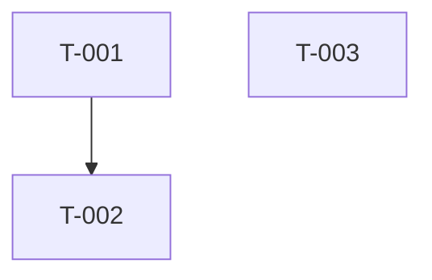

# PRD 拆解为任务模板

> 用途：把产品需求文档拆成适合多 agent 并行执行的任务列表。复制本模板后，先填 PRD 摘要，再拆出独立任务卡。

## 1. PRD 基本信息

- PRD 名称：
- PRD 版本：
- 作者：
- 日期：
- 关联项目：
- 关联里程碑：

## 2. 需求摘要

用简洁语言说明本 PRD 的目标、用户和核心价值。

- 目标用户：
- 用户问题：
- 解决方案：
- 成功指标：

## 3. 核心流程

描述用户或系统从开始到完成的主路径。

1. 
2. 
3. 
4. 

## 4. 功能清单

| 功能编号 | 功能名称 | 用户价值 | 优先级 | 是否本期 |
| --- | --- | --- | --- | --- |
| F-001 |  |  | P0 | 是 |
| F-002 |  |  | P1 | 是 |
| F-003 |  |  | P2 | 否 |

## 5. 任务拆解原则

- 每个任务应能由一个 agent 独立完成。
- 每个任务必须有明确的可写路径或资源边界。
- 任务之间的依赖必须显式写出。
- 共享文件优先拆成顺序任务，避免并行覆盖。
- 每个任务都必须包含验收标准和验证方式。

## 6. 任务列表

| 任务编号 | 任务名称 | 来源功能 | 建议 Agent | 可写范围 | 依赖任务 | 验收摘要 | 优先级 |
| --- | --- | --- | --- | --- | --- | --- | --- |
| T-001 |  | F-001 |  |  | 无 |  | P0 |
| T-002 |  | F-001 |  |  | T-001 |  | P1 |
| T-003 |  | F-002 |  |  | 无 |  | P1 |

## 7. 任务卡草稿

### T-001：

- 目标：
- 背景：
- 允许修改：
- 禁止修改：
- 输入资料：
- 交付物：
- 验收标准：
- 验证方式：

### T-002：

- 目标：
- 背景：
- 允许修改：
- 禁止修改：
- 输入资料：
- 交付物：
- 验收标准：
- 验证方式：

### T-003：

- 目标：
- 背景：
- 允许修改：
- 禁止修改：
- 输入资料：
- 交付物：
- 验收标准：
- 验证方式：

## 8. 跨任务依赖图

## 9. 验收映射

| PRD 验收点 | 对应任务 | 验证方式 | 负责人 |
| --- | --- | --- | --- |
|  |  |  |  |
|  |  |  |  |

## 10. 风险与开放问题

| 类型 | 内容 | 影响 | 需要谁确认 | 状态 |
| --- | --- | --- | --- | --- |
| 风险 |  |  |  | 未处理 |
| 问题 |  |  |  | 待确认 |

## 11. 拆解完成检查

- [ ] 每个 P0 功能都有对应任务。
- [ ] 每个任务都有唯一负责人或建议 agent。
- [ ] 每个任务都写明了允许修改范围。
- [ ] 没有两个并行任务同时修改同一文件。
- [ ] 所有依赖任务已标注。
- [ ] 验收标准可以被实际检查。

